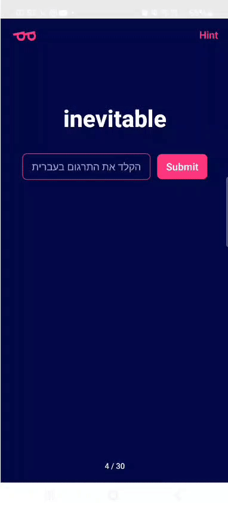

# the WordNerd   

[Install on Android](https://expo.dev/accounts/nimrodlahav/projects/word_nerd_front/builds/6065415f-c41e-4724-8269-9bcf4b2a9aca), or contact for apk.

WordNerd is an AI powered vocabulary-building app for Hebrew speakers learning English. Using Transformer-based language models, WordNerd provides dynamic and personalized feedback. This is crucial, as most languages are flexible and fluid: they don’t follow exact rules, making them rich and alive, but also challenging to acquire. Hence the need for a non-binary feedback. Below are visuals of **some** of the application's UX:

**Home**  
Here the user can choose whether to practice his current cycle - which contains all the clusters he is memorizing at this period in time. Also, it's optional to view current progress and details regarding preferred system settings.

  

**Quiz**  
For each one of the three days (of a cycle), you are quizzed on the words in your current batch/es. Each quiz appends a score to your total "familiarity score".  

  
  &nbsp;&nbsp;&nbsp;
  

**Cycle Initialization**  
At the beginning of each interval, the user wipes-out words he already knows, resetting his batches for the next cycle.

    
  

    

*For additional documentation, links, screenshots and supplementary information, contact me @ [LinkedIn Profile](https://www.linkedin.com/in/nimrod-lahav-03793523b/)*
